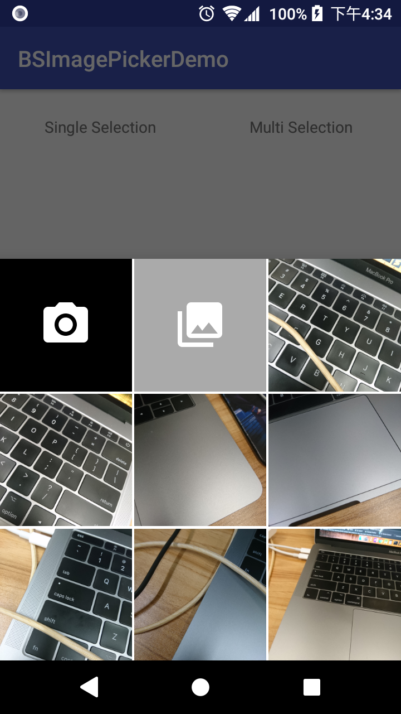
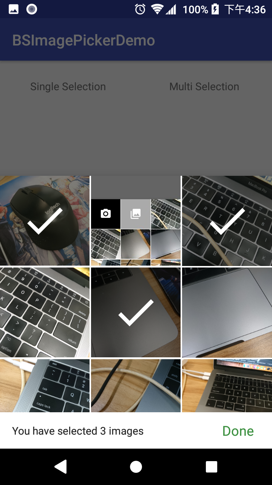

# BSImagePicker

BS stands for [BottomSheet](https://developer.android.com/reference/android/support/design/widget/BottomSheetDialogFragment).

<p>
&nbsp;&nbsp;&nbsp;&nbsp;

</p>

## Why this library?

When your app needs user to pick one or more images from their device, it is still quite painful in Android.  
Without any customization, you first need to ask user whether he/she wants to take a picture using camera, or select one from a Gallery app.  
Then you have to write quite some code to launch a Camera intent.  
Not to mention that you cannot even let user select multiple images.

So an image picker that solve all these pains is almost present in every app.  
And this library does the below:

1. Without the need to ask user whether to take photo or select from gallery, these options are all in one dialog;
2. Works for both single and multiple selections;
3. Handle asking permissions for you;
4. You just need to show this dialog, and register callbacks that give you a `Uri` or `List<Uri>`.

The UI design of this library is referenced from [TedBottomPicker](https://github.com/ParkSangGwon/TedBottomPicker).  
I like the design of his library! And in fact I have used his library in 2 production apps already.  
But there are still some defects that annoyed me:

1. You need to handle permissions by yourself; but as a `Fragment`, it is a perfect place to handle by itself;
2. I don't like the design of his multiple selection mode;
3. He query media files on the Main Thread. If you query all images in the device, that will absolutely block your app's response! I implemented using CursorLoader instead;
4. He does not handle fragment lifecycle correctly. Quite some number of crashes due to referencing a null `Context` has been reported from my production apps, and his library cannot survive configuration change (e.g. device rotation);
5. He hard-coded to use his own `FileProvider`, which will crash if your app has your own `FileProvider`.

But note that `BSImagePicker` does not allow selection from camera and gallery when in multi selection mode, which is possible in `TedBottomPicker`, due to the difference in UI/UX.  
Also, a recent release of `TedBottomPicker` also supports selecting vidoes. This is not supported by `BSImagePicker` as well.

## How to Use

Minimum SDK: 16

### Add to Project

First make sure `jcenter()` is included as a repository in your **project**'s build.gradle:  

```groovy
allprojects {
    repositories {
        jcenter()
    }
}
```

And then add the below to your app's build.gradle:  

[  ](https://bintray.com/lsw19921030/maven/BSImagePicker/_latestVersion)

```groovy
    implementation 'com.asksira.android:bsimagepicker:{refer to the version badge above}}'
```

You also need to make sure you have included `'com.android.support:support-v4:{supportLibraryVersion}` in your dependencies.

### Step 1: Create your own FileProvider

Just follow the guide from [Official Android Document](https://developer.android.com/reference/android/support/v4/content/FileProvider#ProviderDefinition).

### Step 2: Create a BSImagePicker using a builder

After you have defined your own `FileProvider`, pass the authority String to the constructor of `BSImagePicker.Builder`.

The below code snippet also shows all configurables, with some description.  

Single Selection:

```java
       BSImagePicker singleSelectionPicker = new BSImagePicker.Builder("com.yourdomain.yourpackage.fileprovider")
               .setMaximumDisplayingImages(24) //Default: Integer.MAX_VALUE. Don't worry about performance :)
               .setSpanCount(3) //Default: 3. This is the number of columns
               .setGridSpacing(Utils.dp2px(2)) //Default: 2dp. Remember to pass in a value in pixel.
               .setPeekHeight(Utils.dp2px(360)) //Default: 360dp. This is the initial height of the dialog.
               .hideCameraTile() //Default: show. Set this if you don't want user to take photo.
               .hideGalleryTile() //Default: show. Set this if you don't want to further let user select from a gallery app. In such case, I suggest you to set maximum displaying images to Integer.MAX_VALUE.
               .setTag("A request ID") //Default: null. Set this if you need to identify which picker is calling back your fragment / activity.
               .dismissOnSelect(true) //Default: true. Set this if you do not want the picker to dismiss right after selection. But then you will have to dismiss by yourself.
               .useFrontCamera(true) //Default: false. Launching camera by intent has no reliable way to open front camera so this does not always work.
               .build();
```

Multiple Selection:

```java
       BSImagePicker multiSelectionPicker = new BSImagePicker.Builder("com.yourdomain.yourpackage.fileprovider")
               .isMultiSelect() //Set this if you want to use multi selection mode.
               .setMinimumMultiSelectCount(3) //Default: 1.
               .setMaximumMultiSelectCount(6) //Default: Integer.MAX_VALUE (i.e. User can select as many images as he/she wants)
               .setMultiSelectBarBgColor(android.R.color.white) //Default: #FFFFFF. You can also set it to a translucent color.
               .setMultiSelectTextColor(R.color.primary_text) //Default: #212121(Dark grey). This is the message in the multi-select bottom bar.
               .setMultiSelectDoneTextColor(R.color.colorAccent) //Default: #388e3c(Green). This is the color of the "Done" TextView.
               .setOverSelectTextColor(R.color.error_text) //Default: #b71c1c. This is the color of the message shown when user tries to select more than maximum select count.
               .disableOverSelectionMessage() //You can also decide not to show this over select message.
               .build();
```

### Step 3: Register callbacks

In order to survive configuration change, **I cannot let you simply pass an anonymous interface to the builder. That callback will become null when device orientation changes.**  
So, your caller Activity or Fragment must implements `OnSingleImageSelectedListener` or `OnMultiImageSelectedListener`.

```java
public class MainActivity extends AppCompatActivity implements BSImagePicker.OnSingleImageSelectedListener,
        BSImagePicker.OnMultiImageSelectedListener,
        BSImagePicker.ImageLoaderDelegate,
        BSImagePicker.OnSelectImageCancelledListener {

    //...

    @Override
    public void onSingleImageSelected(Uri uri, String tag) {
        //Do something with your Uri
    }

    @Override
    public void onMultiImageSelected(List<Uri> uriList, String tag) {
        //Do something with your Uri list
    }

    @Override
    public void loadImage(File imageFile, ImageView ivImage) {
        //Glide is just an example. You can use any image loading library you want;
        //This callback is to make sure the library has the flexibility to allow user to choose their own image loading method.
        Glide.with(MainActivity.this).load(imageFile).into(ivImage);
    }

    //Optional
    @Override
    public void onCancelled(boolean isMultiSelecting, String tag) {
        //Do whatever you want when user cancelled
    }
}
```

You can set a `tag` in the picker's builder. This is useful when you need to show more than 1 picker in the same page, so that you have a way to distinguish which one is calling back to your Activity / Fragment.

### Step 4: Show the picker, which is essentially just a DialogFragment

If you called from an Activity:
```java
       //pickerDialog is the one your created in Step 2
       pickerDialog.show(getSupportFragmentManager(), "picker");
```

If you called from a Fragment:
```java
       //pickerDialog is the one your created in Step 2
       pickerDialog.show(getChildFragmentManager(), "picker");
```

## Android Q Scoped Storage issue

If you target Android SDK Version 29 or higher, you will encounter the problem brought by scoped storage.  
This library assumes you will just add `android:requestLegacyExternalStorage="true"` to your `<application>` tag in AndroidManifest.xml.

If you want to stick with the scoped storage approach, i.e. do not want to add that legacy attribute, you can consider forking the library and change the code yourself.  
Or I would appreciate your help by suggesting in [issue #33](https://github.com/siralam/BSImagePicker/issues/33).

## Customization of layouts

You can easily customize various layouts and string resources by simply overriding the original resource I defined in the library.

### Customize layout of camera tile or gallery tile

Define your own `R.layout.item_picker_camera_tile.xml` or `R.layout.item_picker_gallery_tile.xml`. But make sure the root ViewGroup is a `FitWidthRelativeLayout` with `app:view_aspectRatio="1"`.  
You do not need to specify any View id.

### Customize String resources of the bottom bar of multi-selection

Define below String resources with the same ID in your own app:

```xml
    <string name="imagepicker_multiselect_done">Done</string>
    <string name="imagepicker_multiselect_not_enough_singular">You have to select 1 more image</string>
    <string name="imagepicker_multiselect_not_enough_plural">You have to select %d more images</string>
    <string name="imagepicker_multiselect_enough_singular">You have selected 1 image</string>
    <string name="imagepicker_multiselect_enough_plural">You have selected %d images</string>
    <string name="imagepicker_multiselect_overselect">You cannot select more than %d images</string>
    <string name="imagepicker_no_image_text_view">There are no image in your device.</string>
```

**IMPORTANT: Your string resources must match the number of replaceables (%d) with the original resources above.**

You ask why don't I use plurals? [See this post](https://stackoverflow.com/questions/50245917/plurals-one-is-not-working-always-used-other-resource).

## Limitations

1. You cannot filter the images showing in the picker, e.g. From only a specific folder.
2. Since the customization of layouts are done by resource overriding, it is impossible to set different style for different pickers in the same app. I consider this as an edge case.

## Release notes

v1.3.2
- Added cancel callback
- Added front facing camera option, but it is just a hack so does not always work.

v1.3.0
- Changed support libraries to AndroidX

v1.2.2
- Fixed issue #32 because the imageLoaderDelegate is passed to the adapter before assigning nor throwing exceptions

v.1.2.1
- Caller Activity or Fragment now needs to implement ImageLoaderDelegate and provides its own way to load the image file into the file ImageView. This allows user to use any image loading library they want instead of binding to Glide v4.

v1.1.0
- Picker now supports a tag (String) as an identifier, so that you can identify which picker calls back your fragment / activity. This is useful if you need to launch more than 1 picker in the same fragment / activity. (Solves #3)
- Picker now displays a TextView if there is nothing to show, instead of just dimming the screen. (Solves #9)
- You can now decide whether to dismiss the picker after a selection. (Solves #6)

v1.0.1 
First Release.

## License

```
Copyright 2018 Sira Lam

Licensed under the Apache License, Version 2.0 (the "License");
you may not use this file except in compliance with the License.
You may obtain a copy of the License at

    http://www.apache.org/licenses/LICENSE-2.0

Unless required by applicable law or agreed to in writing, software
distributed under the License is distributed on an "AS IS" BASIS,
WITHOUT WARRANTIES OR CONDITIONS OF ANY KIND, either express or implied.
See the License for the specific language governing permissions and
limitations under the License.
```